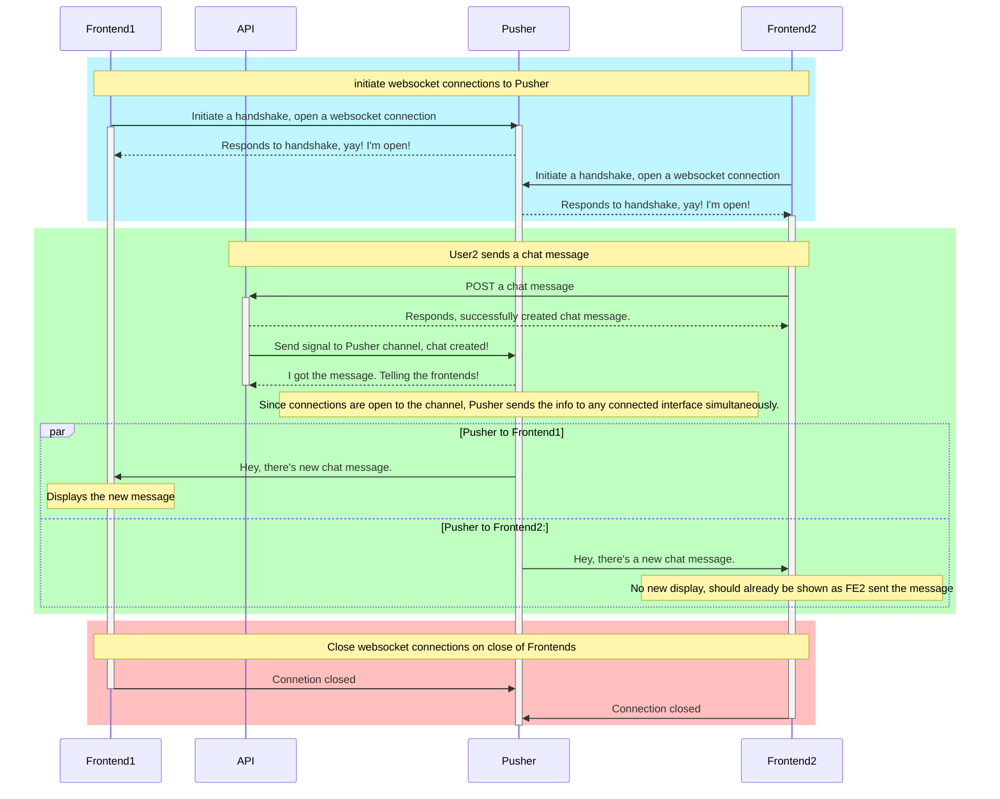
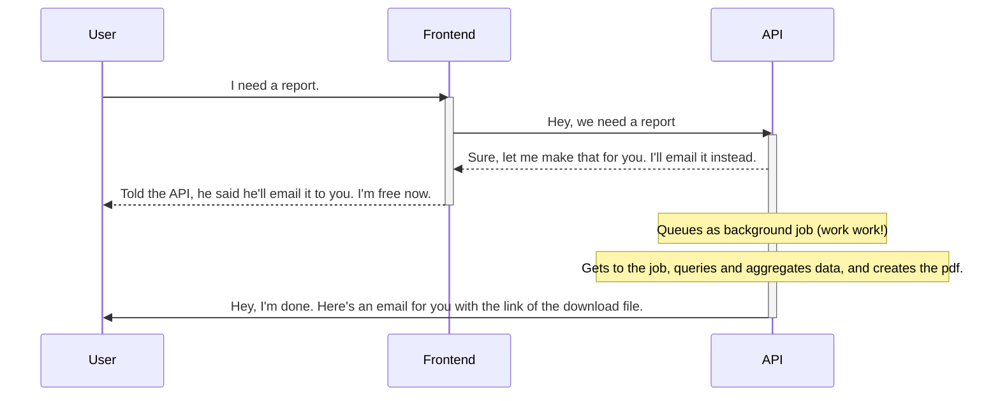
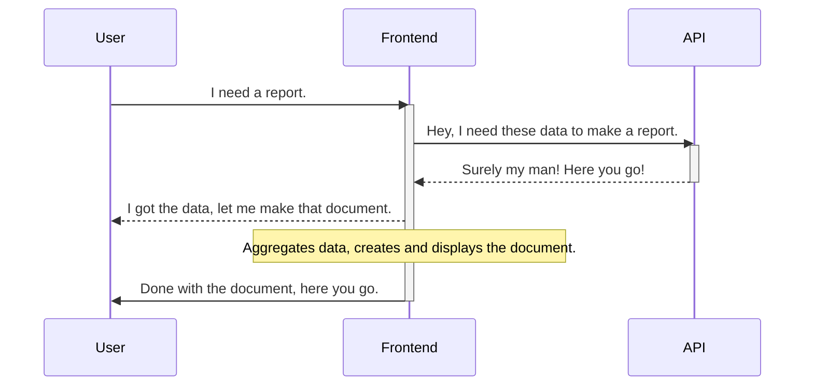
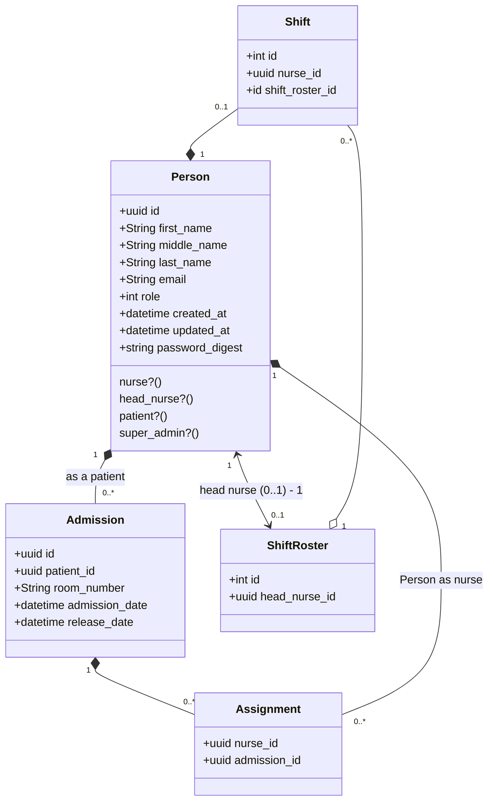
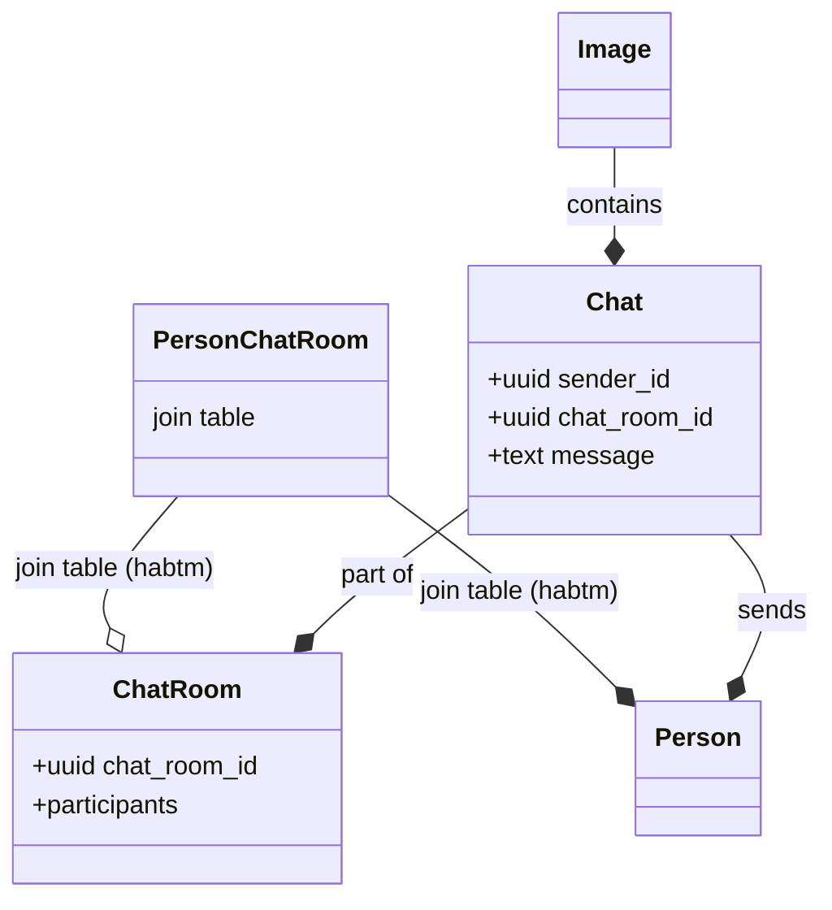
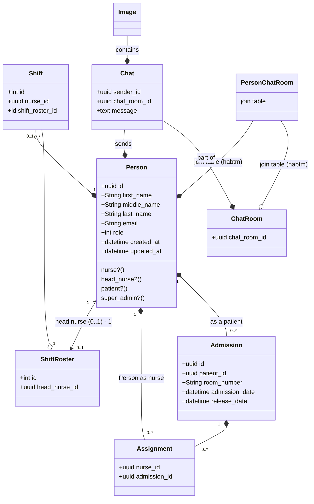

# Sourcepad Backend Exam

[Backend exam is here.](https://github.com/open-sourcepad/exam-marc-dagatan-ror/blob/main/backend_exam.md)

This is a brief document how I would design a backend for the given specifics.

## Note

As this is for an exam, I have decided to put it in markdown format. But if it was a real project it would require a whole lots of research, and discussion with the team and project owner; which would have been deeply documented in coda.io (documentation), and broken down to tasks/sprints/epics in shortcut.com (project management tool). Or any documentation or project management tool that the company uses.

## Overview

This will be a hospital patient management system with chat functionality. Running on Ruby on Rails API.

## Chat Feature

We have a special feature that needs to be discussed, which is the chat feature. In order to build a realtime chat feature, we will be using a third-party api called [Pusher](https://pusher.com) for an affordable hosted websockets solution. This will allow our frontend application to have an open line of communication to our API.

Basically, we subscribe the front-end to a channel which is a constant open connection to Pusher. When we create a chat message in the API, the API sends a signal/data to the Pusher channel allowing any interface subscribe to a "channel" to receive it without having to refresh or forcefully fetch new data.

The following diagram shows how this works with 2 frontends active, the API, and the Pusher service:



As you can see in the diagram, the API is only active during a small window which means our own server infrastructure will have lesser load saving us expenses.

Both Frontends may be active, but it is client-side which will not be taxing our own servers.

## Reports Feature

There are two ways we can tackle this. For larger reports, we can have the backend api handle this and email a download link to the requesting user. But, in this case, there isn't much to report on. We can implement a simple reporting interface by providing an api endpoint for the reports together with the [ransack gem](https://github.com/activerecord-hackery/ransack).

Ransack already provides a robust out of the box query generation tool to quickly filter, or organize data. If this isn't robust enough, we can make our custom query objects, and store it in `app/queries`. It really depends on the need we have. Also, we can make custom report outputs in json using the previously mentioned blueprinter gem.

As for the pdf file, there are lots of react packages to generate csv, or pdf files.

The only argument to go for the backend api handling report generation would be if it were complex reports with complex scopes and data that needs to be handled. Otherwise, the SPA can handle this instead.

The following diagram shows how it will work if the API generates the document:



In the diagram above, it would show that the API will be working on this report longer, and will need to queue it up among other background jobs and may take a while to be processed. Although, the positive side with this is the user is now free to do anything with the frontend again while it waits for the document to be made.

The following diagram shows how it work if the frontend generates the document:



In the diagram above, the API only operates during the request and returns the data needed for the report. The frontend processes the data, and creates and displays the document. Depending on the size of the report, it may be a slower experience for the user and might not feel instantaneous.

It could be said that having the API take most of the load to make the document is the way to go, so as to free the user and continue any other interaction with the frontend. It really depends on which the user needs, and how big reports will be. For the sake of this exercise, let's assume that the API would need to work on a lighter load to process more of the requests being made by the nurses and head nurses.

## Models

An argument can be made that the `Patient`, `Nurse`, `HeadNurse` models should be a using a Singe Table Inheritance scheme but these might present challenges early-on, and keeping to the Rails way, shouldn't be done unless necessary. There is always space for refactoring later on. We would like the system to be easily understood by anyone coming in and making changes to it, so we would like to lessen the complexity of the application as much as possible. There isn't much difference in the three of them except that they have different permissions.

With that in mind, we will be doing all the three in a `Person` model instead. With a `role` field instead. `SuperAdmin` also falls into the `Person` model.

> In many cases, a superadmin is required to login, make changes, and the changes are logged. We will not be illustrating that in this practice.
> In this practice as well, we will also assume that a Nurse or Head Nurse can be `patients`.

`ShiftRoster` model will be used to team up nurses, and be defined under one head nurse. Additional information about a shift can be added here, which will not be defined.

`Admission` model will define if a `Person` is a patient, when the patient was admitted, and `has_many` nurses `through` an `Assignment` model.

The following diagram illustrates how everything is associated together.



---

As for the Chat functionality, we will be using a simple relationship between multiple `Person`, `ChatRoom`, and `ChatMessage`. We will also add some form of media as an attachment, such as an `Image` attached to a `ChatMessage`.



---

Altogether, it looks like this:



> Methods for the different class models can be included later on as we see fit.

### Person

The `Person` role will define your basic information for a person. All additional information can be housed in `AdditionalInformation` Model, but we will not define it in this practice. All details a person houses

#### Schema

| Type      | Attribute       | Default          | Null  | Description                                                    |
| --------- | --------------- | ---------------- | ----- | -------------------------------------------------------------- |
| uuid (PK) | id              | system generated | false | primary key for Person                                         |
| string    | first_name      | null             | false | defined on creating                                            |
| string    | middle_name     | null             | true  | not required                                                   |
| string    | last_name       | null             | false | defined on creating                                            |
| string    | email           | null             | false | defined on creating                                            |
| string    | password_digest | null             | false | defined on creation                                            |
| int       | role            | 0                | false | `enum` roles as `person`, `nurse`, `head_nurse`, `super_admin` |
| datetime  | created_at      | system generated | false |                                                                |
| datetime  | updated_at      | system generated | false |                                                                |

> I would personally change updated_at, and add a changelog instead. Maybe use `ActiveModel::Dirty`, use a `has_many` ChangeLog. as for the `updated_at`, probably make a method, get the latest `ChangeLog` and use the `created_at` . OR, for easier implementation, use `PaperTrail` gem. Although, since the requirements doesn't state `logs`, this shouldn't be added.

#### Person role enum

We will use `enum` for the role of the person allowing us access to prebuilt functionality for scoping, methods, etc. This will later help-on for defining permissions and associations.

| Int | Role        |
| --- | ----------- |
| 0   | person      |
| 1   | nurse       |
| 2   | head_nurse  |
| 3   | super_admin |

#### Associations

The following should be the associations of the `Person` model. For the sake of clarity, it is presented in the Ruby on Rails way of specifying associations. It may be incomplete, and details might need to be added to the associations.

```rb
has_one :shift, inverse_of: :nurse
has_one :shift_roster, through: :shift
has_one :nurses_roster, class_name: "ShiftRoster", inverse_of: :head_nurse

has_many :admissions, inverse_of: :patient, dependent: :destroy
has_many :assignments, inverse_of: :nurse, dependent: :destroy
has_many :admission_assignments, through: :assignments, source: :admissions, class_name: "Admission"
has_many :chats, inverse_of: :sender
has_many :my_nurses, through: :admissions, source: :nurses, class_name: "Person"
has_many :my_patients, through: :assignments, source: :patient

has_and_belongs_to_many :chat_rooms, join_table: :chat_rooms_people
```

> Suggested associations of models.

#### Validations

The following shows the validations required for this model:
| Attribute | Validation |
|---|---|
| first_name | required, atleast 2 characters, no special characters |
| middle_name | not required, no special characters |
| last_name | required, atleast 2 cahracters, no special characters |
| email | required, make sure this follows email format |
| role | required |

#### Methods

Defined methods that we will commonly use, and will be referenced like an attribute, or scope throughout this exercise.

| name     | funciton            | description                                                |
| -------- | ------------------- | ---------------------------------------------------------- |
| patients | scope, class method | scope users with `admissions`                              |
| patient? | instance method     | returns a `<bool>` if user has any record of `admissions`. |

> #### Patient
>
> Since we have a defined scope and method for getting people that are patients, and if the person is a patient, we will treat `patient` like a role through out this document.

---

### ShiftRoster

The `ShiftRoster` model basically holds the roster of nurses of a head nurse. also can be specified here which time their shift is.

#### Schema

| Type     | Attribute     | Default          | Null  | Description                              |
| -------- | ------------- | ---------------- | ----- | ---------------------------------------- |
| int (PK) | id            | system generated | false | primary key, id..                        |
| uuid     | head_nurse_id | none             | false | head nurse should be assigned right away |
| time     | shift_start   | none             | true  | start of shift                           |
| time     | shift_end     | none             | true  | end of shift                             |

#### Associations

```rb
belongs_to :head_nurse, foreign_key: :nurse_id, class_name: "Person", inverse_of: :nurses_roster
has_many :shifts, dependent: :destroy
has_many :nurses, through: :shifts
```

#### Validations

| Attribute            | Validation                                                    |
| -------------------- | ------------------------------------------------------------- |
| person_is_head_nurse | custom validation to validate that the person is a head nurse |

We don't validate that the `shift_start` is before `shift_end` as people may have shift start times that is after the `shift_end` time but is the next day. We also don't validate that length of time between `shift_start` and `shift_end` as some hospitals do have varying length of shifts, or length may change depending upon need.

---

### Shift

The `Shift` model is a join model, but can house other details as `date_of_assignment` to the shift, or other information as necessary. Although, it is necessary to define this model so we can state the person as a nurse.

#### Schema

| Type     | Attribute       | Default          | Null  | Description |
| -------- | --------------- | ---------------- | ----- | ----------- |
| int (PK) | id              | system generated | false | primary key |
| uuid     | nurse_id        | null             | false | Person id   |
| int      | shift_roster_id | null             | false | roster id   |

#### Associations

```rb
belongs_to :nurse, primary_key: :nurse_id, class_name: "Person"
belongs_to :shift_roster
```

#### Validations

| Attribute       | Validation                                                                                                                        |
| --------------- | --------------------------------------------------------------------------------------------------------------------------------- |
| person_is_nurse | custom validation, make sure that the person is a nurse ONLY. Head nurses, normal people, and admistrators can't be assigned here |

---

### Admission

Admission of `Patient` into the hospital. Holds who the person as a patient is, who are the nurses assigned to the patient, admission and release dates, and the room number.

#### Schema

| Type      | Attribute      | Default          | Null  | Description                                                                                       |
| --------- | -------------- | ---------------- | ----- | ------------------------------------------------------------------------------------------------- |
| uuid (PK) | id             | system generated | false | identifier, Primary key                                                                           |
| uuid      | patient_id     | null             | false | id of person admitted as a patient                                                                |
| string    | room_number    | null             | true  | patients may be admitted into the system without an assigned room yet, but can later be filled in |
| datetime  | admission_date | Time.zone.now    | false | Time the patient was admitted, defaulted to current time but can be changed                       |
| datetime  | release_date   | null             | true  | not required, can be filled in upon the release of a patient                                      |

#### Associations

```rb
belongs_to :patient, class_name: "Person", inverse_of: :admissions, primary_key: :patient_id
has_many :assignments, dependent: :destroy
has_many :nurses, through: :assignments
```

#### Validations

| Attribute      | Validaton                      |
| -------------- | ------------------------------ |
| room_number    | required                       |
| admission_date | required                       |
| release_date   | should be after admission date |

---

### Assignment

`Assignment` model is sort of a join model, but can also hold other information. Also, if a medical/check-up notes is needed, it can be associated to this model. Nurses are required to check up on their patients round the clock, and notes on their current status are made.

#### Schema

| Type     | Attribute    | Default          | Null  | Description           |
| -------- | ------------ | ---------------- | ----- | --------------------- |
| int (PK) | id           | system generated | false | primary key           |
| uuid     | admission_id | null             | false | admission id          |
| uuid     | nurse_id     | null             | false | Id of person as nurse |

#### Associations

```rb
has_one :patient, through: :admission, class_name: "Person"

belongs_to :admission
belongs_to :nurse, foreign_key: :nurse_id, class_name: "Person", inverse_of: :assignments
```

#### Delegations

#### Validations

| Attribute       | validation                                             |
| --------------- | ------------------------------------------------------ |
| person_is_nurse | custom validation, validate that the person is a nurse |

---

### ChatRoom

Holds the participants of the chat, and the chat message trail. Fairly straightforward.

#### Schema

| Type      | Attribute | Default | Null  | Description     |
| --------- | --------- | ------- | ----- | --------------- |
| uuid (pk) | id        | null    | false | id, primary key |

#### Associations

```rb
has_and_belongs_to_many :participants, class_name: "Person", join_table: "chat_rooms_people", foreign_key: :person_id
has_many :chats, dependent: :destroy
```

#### Validations

Not much to validate in `ChatRoom` model. But, there are permissions which will be handled in a different part.

---

### Chat

The `Chat` model is the basic composition of the chat feature. Holds the message, and the sender. Also holds the image attachment if any. Since Rails 5.2, attaching media to models has been as easy as `has_many_attached :images`.

#### Schema

| Type      | Attribute    | Default          | Null  | Description               |
| --------- | ------------ | ---------------- | ----- | ------------------------- |
| uuid (pk) | id           | system generated | false | id, primary key           |
| uuid      | sender_id    | null             | false | person id as sender       |
| uuid      | chat_room_id | null             | false | chat room id              |
| text      | message      | null             | false | can't send empty messages |

#### Associations

```rb
belongs_to :sender, class_name: "Person", inverse_of: :chat
belongs_to :chat_room
```

#### Validations

| attribute | validation                       |
| --------- | -------------------------------- |
| message   | required, atleast be 1 character |

#### Attachments

As mentioned previously, we will have many image attachments allowable for the `Chat` model. We define this simply by putting in the following in the model:

```rb
has_many_attached :images
```

---

### Image / Media

Defined for the sake of representation. But we basically mean this as the model, migrations, and parts of `ActiveStorage`. These can be generated by doing the following:

```bash
$ rails active_storage:install
$ rails db:mgirate
```

Some Rails magic sauce happening here. No need to edit, or make special changes for this exercise.

## API

We're going to use a REST structured API, keeping it as RESTful as possible.

### Authorization of requests

Our authentication method will be explained in the latter parts of the document, but should be defined in the requests in the headers as `Authorization: Bearer {jwt_hash_token}`

### Format

To keep it simple, all requests and responses will be in json format. All keys received in the request and sent in responses should be in `snake_case` format.

Whichever frontend framework can handle conversion of the keys to whichever format it may need. If we're using React, there's a middleware for Axios called [axios-case-converter](https://www.npmjs.com/package/axios-case-converter).

### Errors

All failed requests should be responded by the proper failure code. If error message/s are needed, the following format should be followed:

```json
// Multiple errors
{
	errors: {
		attribute: ["array", "of", "errors"],
		attribute: ["array", "of", "errors"],
	}
}

// Single error
{
	error: { message: "error message" }
}
```

---

### Model Serialization

To make the responses easier to build, we will use the [blueprinter gem](https://github.com/procore/blueprinter), to easily serialize data into json. That way, we wouldn't need to specify the json structure each time.

All serializations of models will be put in the `app/blueprinter` directory.

### Nested Attributes

When creating records for models and there are nested attributes for associated models, some would argue the use of `accepts_nested_attributes_for`. In our case, we would rather use a form object in `app/forms` to have a freer control of how we create records.

### Authentication

No complex authentication needed. A simple JWT `bcrypt` authentication is all that is required for this exercise. Additional methods should be added in the models, and controllers to make this work.

### Authorization

As specified, there are api endpoints that will only be available depending on the users' role. To tackle this, we will use the [pundit gem](https://github.com/varvet/pundit) to quickly implement a simple but robust authorization system. Access by role will be specified down below by endpoint.

### Features and Endpoints

The following parts will discuss the features, and endpoints required for each feature. It will not be discussed in full details as it is up to the developer how they will do it, but suggestions would be added in based on common Rails conventions.

Endpoints will be broken down to URL (with method), Headers, Request Body, Response, and Auth level.

> **_For all endpoints, assume that is prefixed with "https://domain.name/api"_**

---

### Auth

#### Login

URL:

```
auth POST
```

headers: none

request body:

```json
{
  auth: {
    email: <string>,
    password: <string>
  }
}
```

response:

```json
{
  auth_key: <string>,
  user: <serialized person, current_user>
}
```

Authorization access:
PUBLIC ENDPOINT
| Patient | Nurse | Head Nurse | Admin |
|---|---|---|---|
| Y | Y | Y | Y |

---

### People

For people, we will separate endpoints for each type of user for easier consumption for the frontend. But, the json structure will be using whatever blueprint we have for it, unless specified otherwise.

### Patient

#### Index

URL:

```
patients GET
```

headers: Authorization

request body:

```json
{
  page: <int>,
  limit: <int>, // Allow setting of limit. Defaulted to 50
  order: <string>, // Options: asc, desc
  order_by: <string>, // Options: first_name, last_name, middle_name, email
  query: <hash>, // Allow queries/filtering by following ransack format
  assigned_to_roster: <bool>, // Option for head nurse, to quickly filter out patients of own nurse roster
}
```

response:

Return only `patients` scoped `Person`

```json
<array of serialized people>
```

Authorization access:
PUBLIC ENDPOINT
| Patient | Nurse | Head Nurse | Admin |
|---|---|---|---|
| N | Only patients assigned to nurse | Y | Y |

#### Patient

URL:

```
patients/:id GET
```

headers: Authorization

request body:

```json
na
```

response:

```json
{
  ...serialized person,
  admission: {
    ...serialized admission,
    nurses: <array of serialized person as nurses>
  }
}
```

Authorization access:
PUBLIC ENDPOINT
| Patient | Nurse | Head Nurse | Admin |
|---|---|---|---|
| Only own records | Only patients assigned to nurse | Y | Y |

#### Create Patient

URL:

```
patients POST
```

headers: Authorization

request body:

```json
{
  person: {
    first_name: <string>, // required
    middle_name: <string>, // optional
    last_name: <string>, // required
    email: <string>, // required
    password: <string>, // required
    password_confirmation: <string>, // required
    admission: {
      room_number: <string>, // optional
      admission_date: <string datetime>, // required
      release_date: <string datetime>, // optional
      nurses: <array of ids>, // optional
    }
  }
}
```

> `role` attribute for the Person should automatically be set in the controller, or form object.
> Use a form object, has nested records for `admission` and `assignment`.

response:

```json
{
  ...serialized person,
  admission: {
    ...serialized admission,
    nurses: <array of serialized person as nurses>
  }
}
```

Authorization access:
| Patient | Nurse | Head Nurse | Admin |
|---|---|---|---|
| N | N | Y, Can only assign nurses within own roster | Y |

#### Update Patient

URL:

```
patients/:id PATCH
```

headers: Authorization

request body:

```json
{
  person: {
    first_name: <string>, // required
    middle_name: <string>, // optional
    last_name: <string>, // required
    email: <string>, // required
    password: <string>, // required
    password_confirmation: <string>, // required
    admission: {
      room_number: <string>, // optional
      admission_date: <string datetime>, // required
      release_date: <string datetime>, // optional
      nurses: <array of ids>, // optional
    }
  }
}
```

> `role` attribute for the Person should automatically be set in the controller, or form object.
> Use a form object, has nested records for `admission` and `assignment`.

response:

```json
{
  ...serialized person,
  admission: {
    ...serialized admission,
    nurses: <array of serialized person as nurses>
  }
}
```

Authorization access:
| Patient | Nurse | Head Nurse | Admin |
|---|---|---|---|
| N | Y, can't edit nurses, admission records, or if the patient is also a nurse or head nurse | Y, Can only assign nurses within own roster | Y |

#### Destroy Patient

URL:

```
patients/:id DELETE
```

headers: Authorization

request body:

```json
n / a
```

response:

```json
{
  "message": "Successfully deleted #{patient.full_name}."
}
```

Authorization access:
| Patient | Nurse | Head Nurse | Admin |
|---|---|---|---|
| N | N | N | Y |

### Nurse

#### Index

URL:

```
nurses GET
```

headers: Authorization

request body:

```json
{
  page: <int>,
  limit: <int>, // Allow setting of limit. Defaulted to 50
  order: <string>, // Options: asc, desc
  order_by: <string>, // Options: first_name, last_name, middle_name, email
  query: <hash>, // Allow queries/filtering by following ransack format
  assigned_to_roster: <bool>, // Option for head nurse, to quickly filter out patients of own nurse roster
}
```

response:

Return scoped `nurses` and `head_nurses` of `Person` model.

```json
<array of serialized people>
```

Authorization access:
| Patient | Nurse | Head Nurse | Admin |
|---|---|---|---|
| Y, only assigned nurses | Only nurses in same roster | Y, Only nurses in own roster | Y |

#### Nurse

URL:

```
nurses/:id GET
```

headers: Authorization

request body:

```json
na
```

response:

```json
{
  ...serialized person,
  assignments: <array of serialized assignments of nurse>
}
```

Authorization access:
PUBLIC ENDPOINT
| Patient | Nurse | Head Nurse | Admin |
|---|---|---|---|
| Only assigned nurse | Only own record | Only nurses in own roster | Y |

#### Create Nurse

URL:

```
nurses POST
```

headers: Authorization

request body:

```json
{
  person: {
    first_name: <string>, // required
    middle_name: <string>, // optional
    last_name: <string>, // required
    email: <string>, // required
    password: <string>, // required
    password_confirmation: <string>, // required
    assignments: [<string>], // array of admission_id, optional
  }
}
```

> `role` attribute for the Person should automatically be set in the controller, or form object.
> Use a form object, generate automatically `assignments` only using the `assignments` array.

response:

```json
{
  ...serialized person,
  assignments: <array of serialized assignments of nurse>
}
```

Authorization access:
| Patient | Nurse | Head Nurse | Admin |
|---|---|---|---|
| N | N | N | Y |

> Creating of nurses can't be done by a head nurse, only admins should be able to create nurses.

#### Update Nurse

URL:

```
nurses/:id PATCH
```

Request body:

```json
{
  person: {
    first_name: <string>, // required
    middle_name: <string>, // optional
    last_name: <string>, // required
    email: <string>, // required
    password: <string>, // required
    password_confirmation: <string>, // required
    assignments: [<string>], // array of admission_id, optional
  }
}
```

> `role` attribute for the Person should automatically be set in the controller, or form object.
> Use a form object, generate automatically `assignments` only using the `assignments` array.

response:

```json
{
  ...serialized person,
  assignments: <array of serialized assignments of nurse>
}
```

Authorization access:
| Patient | Nurse | Head Nurse | Admin |
|---|---|---|---|
| N | N | Y, can't edit password, email, and password_confirmation | Y |

#### Destroy Nurse

URL:

```
nurses/:id DELETE
```

headers: Authorization

request body:

```json
n / a
```

response:

```json
{
  "message": "Successfully deleted #{nurse.full_name}."
}
```

Authorization access:
| Patient | Nurse | Head Nurse | Admin |
|---|---|---|---|
| N | N | N | Y |

### Head Nurse

## Service Objects

### SendChat

## Form Objects

It was mentioned earlier the use of form objects specially for different creating/updating of `Person` records. It is best we separate form objects depending on their role as processes or associations that they touch differs per role.

### PatientForm

#### Args

```rb
PatientForm.new(current_user_role = :super_admin, attrs = {})
```

- `current_user_role` - should be used to know which attributes should be edited. Defaulted as an `:super_admin`
- `attrs` - all attributes of `Person`

#### Function

- Should also create `Admission` records aside from creating the `Person` record.
- if user role is `:nurse`, can't create (should not have arrived at this point, and should have been stopped in the controller)
- If user role is `:nurse`, do not allow updating of admission, or if patient is a nurse or head nurse.

### NurseForm

#### Args

```rb
NurseForm.new(current_user_role = :super_admin, attrs = {})
```

#### Function

- Create `Assignment` records aside from creating the `Person` record.
- If user role is `:head_nurse`, can't create (stopped at controller)
- If user role is `:head_nurse`, can't update password, or email

## Testing / Security / Coding Style

We're going to use automated testing suites, linters, and gems. Should be integrated to whichever CI/CD we use and make sure the following requirements are passing before deployment/merge to main branch.

- brakeman - (gem to check security vulnerabilities) - passing when 100% rate for security coverage, no warnings or errors
- fasterer - (gem to check code is performant) - passing when no errors arise
- simplecov - (gem to check for automated testing coverage) - passing when 90% of code has been covered in testing
- bundler-audit - (gem to check if all gems are not vulnerable) - no errors to pass
- rspec - (gem for automated testing) - include all gems needed - cover all kinds of specs - request specs over controller/system specs as this is an API - all specs are passing
- git-lint - (gem to check git commit messages) - no errors to pass
- rubocop - (gem which follows basic ruby, rails, rspec coding conventions) - no errors, warnings are acceptable to pass

> All of these have configurations, and should be configured that the team accepts.
> ie. coding conventions that the team agrees on should be configured in rubocop

## CI / CD

This is a small exercise, so Github Actions should be suffice for this project.
